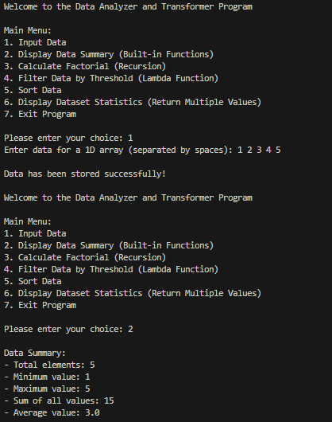
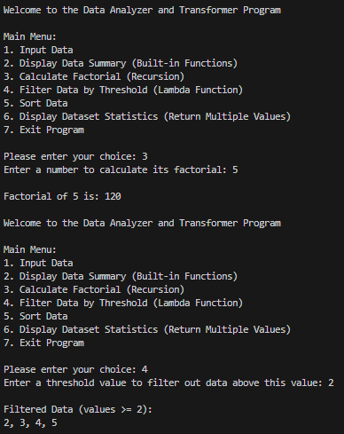
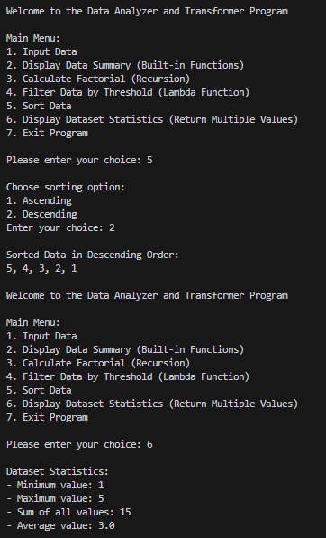

# Data Analyzer and Transformer Program

## Project Overview

The **Data Analyzer and Transformer Program** is a Python-based console application designed to perform various operations on a one-dimensional (1D) array using lists. This project demonstrates the use of built-in functions, user-defined functions (UDFs), recursion, lambda functions, and return statements.

The program allows users to input numerical data, analyze it, filter values, sort data, calculate factorials, and display statistical information through an interactive menu-driven interface.

---

## Features

### 1. Input Data

* Accepts a list of integers from the user.
* Stores the data in a 1D array (Python list).

### 2. Display Data Summary

Uses built-in functions to display:

* Total number of elements
* Minimum value
* Maximum value
* Sum of all values
* Average value

### 3. Factorial Calculation

* Calculates the factorial of a number using a recursive function.

### 4. Data Filtering

* Uses a lambda function with `filter()`.
* Displays values greater than or equal to a user-defined value.

### 5. Data Sorting

Provides sorting options:

* Ascending Order
* Descending Order

### 6. Dataset Statistics

Returns multiple values:

* Minimum
* Maximum
* Sum
* Average


### 8. Exit Program

* Safely terminates the application.

---

## Concepts Demonstrated

### Built-in Functions

The project uses:

* `len()`
* `min()`
* `max()`
* `sum()`
* `round()`
* `filter()`
* `map()`

### User Defined Functions (UDF)

Functions created by the programmer:

* `display()`
* `factorial()`
* `calculate_factorial()`
* `filter_data()`
* `sort()`
* `statistics()`
* `display_statistics()`

### Recursion

Used in:

```python
def factorial(n):
```

### Lambda Function

Used in:

```python
filter(lambda x: x >= value, dataset)
```


### Returning Multiple Values

Used in:

```python
return minimum, maximum, total, average
```
## Output Screenshots

### Output 1


### Output 2


### Output 3

---

## Program Flow

1. User enters dataset.
2. Program stores the data.
3. User selects operations from the menu.
4. Program performs the requested task.
5. Results are displayed.
6. User may continue or exit.

---
## Author

**Sarth Thakar**
